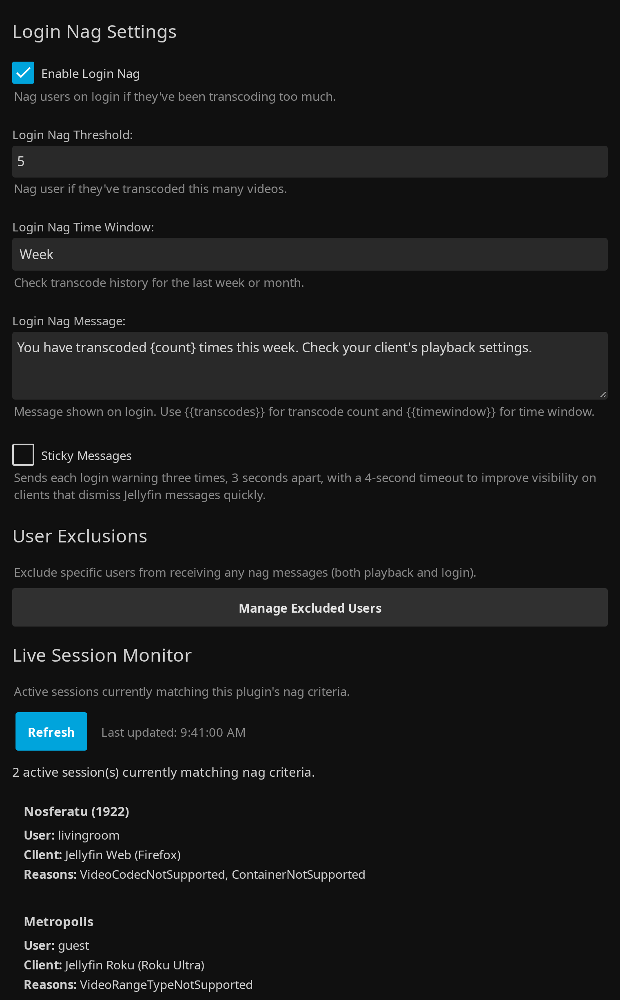

<p align="center">
  
</p>

# Jellyfin Transcode Nag Plugin

<p align="center">
  <a href="https://github.com/voc0der/jellyfin-transcode-nag/releases/latest">
    
  </a>
  <a href="https://github.com/voc0der/jellyfin-transcode-nag/tree/main/tests">
    
  </a>
  <a href="https://github.com/voc0der/jellyfin-transcode-nag/issues">
    
  </a>
  <a href="LICENSE">
    
  </a>
  <a href="https://github.com/voc0der/jellyfin-transcode-nag/blob/main/Jellyfin.Plugin.TranscodeNag.csproj">
    
  </a>
</p>

A Jellyfin plugin that intelligently nags users when they're transcoding due to **unsupported formats or codecs**, while allowing bitrate-based transcoding to pass through without harassment.

<p align="center">
  
</p>
<p align="center">
  <em>Playback nag configuration and trigger reason selection</em>
</p>

<p align="center">
  
</p>
<p align="center">
  <em>Login nags, user exclusions, and the live session monitor</em>
</p>

## What It Does

- Sends a playback nag when Jellyfin reports selected `TranscodeReasons`.
- Ignores bitrate-only transcodes, so users lowering quality for bandwidth do not get warned.
- Can exclude Live TV channel streams from playback nags and login nag history.
- Can send a login nag when a user keeps hitting bad transcodes over the last week or month.
- Lets you exclude users from all nags.
- Includes a live session monitor in the plugin settings page.
- Can broadcast an optional Message of the Day to users at login, with its own user exclusions and client filters.
- Can refuse a hardware (NVIDIA) video transcode before FFmpeg starts when the GPU is out of memory, instead of letting it fail and retry.

## Installation

### Plugin Repository

1. Go to **Dashboard** → **Plugins** → **Repositories**
2. Add `https://raw.githubusercontent.com/voc0der/jellyfin-transcode-nag/main/manifest.json`
3. Install **Transcode Nag** from **Catalog**
4. Restart Jellyfin

### Manual

1. Download the latest ZIP from the [Releases page](https://github.com/voc0der/jellyfin-transcode-nag/releases/latest)
2. Extract it into your Jellyfin plugins directory:
   - Linux: `/var/lib/jellyfin/plugins/`
   - Windows: `%AppData%\Jellyfin\Server\plugins\`
   - Docker: `/config/plugins/`
3. Restart Jellyfin

#### Build from Source

```bash
dotnet build --configuration Release
```

Copy `bin/Release/net8.0/Jellyfin.Plugin.TranscodeNag.dll` into a versioned plugin folder, then restart Jellyfin.

## Configuration

Open **Dashboard** → **Plugins** → **Transcode Nag**.

- Choose which playback transcode reasons should trigger nags. Defaults focus on unsupported container, codec, subtitle, profile, level, resolution, bit depth, framerate, and related compatibility failures.
- Set the playback message, delay, and timeout.
- Enable **Exclude Live TV** if Live TV channel streams should not trigger playback nags or count toward login nags.
- Optionally add client include/exclude filters using case-insensitive text matching. If the include list is empty, all clients are eligible; exclude matches always win.
- If you want login nags, enable them and set the threshold, time window, and message. The login message supports `{{transcodes}}` and `{{timewindow}}`.
- Use **Manage Excluded Users** to opt users out of both playback and login nags.
- Use the built-in live session monitor to see which active sessions currently match your rules.
- Enable **Message of the Day** (off by default) to send an announcement to everyone at login. Its options stay collapsed until the toggle is on, and it has its own message, its own **Manage Excluded Users (MOTD)** list, and its own client include/exclude filters, all independent of the nag settings.
- Enable **GPU resource guard** (off by default) to set a free-VRAM floor, the GPU index to watch, the nvidia-smi timeout and path, and the popup a refused client sees.

## GPU Resource Guard

When a GPU is shared with another workload, a second 4K hardware transcode can fail to allocate
VRAM. Jellyfin's response is to launch FFmpeg, watch it die, and retry - several dead processes and
a generic playback error for the user.

With the guard enabled, Transcode Nag checks free VRAM at the moment Jellyfin is about to start
FFmpeg and refuses the job if it is below your threshold. No FFmpeg process is created, the
requesting client gets a **Transcoding unavailable** popup, and the server log carries one clear
line naming the session, user, device, item, free VRAM, and threshold.

**What is guarded.** Only jobs that both encode video (not a stream copy) and use the NVIDIA path -
`-hwaccel cuda`, `*_nvenc`, `*_cuvid`, or CUDA/NPP filters. Direct Play, Direct Stream, container
remuxing, audio-only transcodes, and CPU-only video transcodes are never refused. This is read from
the FFmpeg command line Jellyfin has already built, so the plugin does not second-guess Jellyfin's
own playback decision.

**Fail-open.** If `nvidia-smi` is missing, times out, returns malformed output, or does not know the
configured GPU index, the guard logs a warning and allows playback. It never denies on ignorance.

**Requirements.** `nvidia-smi` must be runnable by the Jellyfin server process. In a container that
means the NVIDIA container runtime. Set an explicit path in the settings if it is not on `PATH`.

**Scope.** This is admission control, not a GPU scheduler. It never kills running transcodes,
touches other GPU workloads, or changes transcoding quality. There is an unavoidable race between
reading free VRAM and FFmpeg allocating it, so clearing the threshold is not a guarantee - the point
is to refuse the failures that are predictable because VRAM is plainly exhausted.

## Behavior Notes

- Playback nags happen once per video, not once per session.
- Login nags are rate-limited and use stored history from the last 30 days.
- If a user returns to direct play after a bad transcode, login nags are suppressed until they regress again.
- The MOTD is sent once per session at login and is unrelated to transcode history. Sessions that were already signed in when you enabled it receive nothing until they sign in again.
- If a user qualifies for both the MOTD and a login nag, the nag waits for the MOTD to time out first, so clients that show one message at a time still display both.
- A guard refusal returns HTTP 400 to the stream request - the same terminal answer Jellyfin gives when a user lacks video transcoding permission - so clients stop rather than retry.
- Repeated attempts at the same refused stream are each refused, but the client popup and the warning log are de-duplicated for 10 seconds.
- Freeing GPU memory restores normal playback on the next attempt. No setting change or restart is needed.
