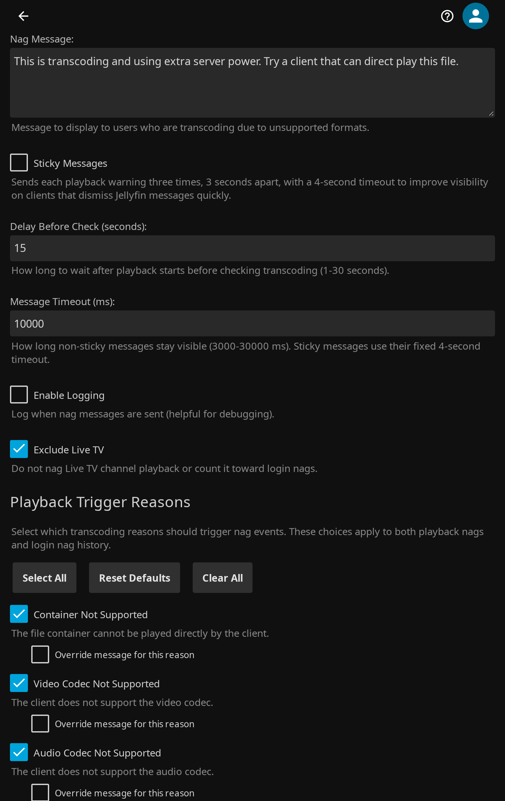
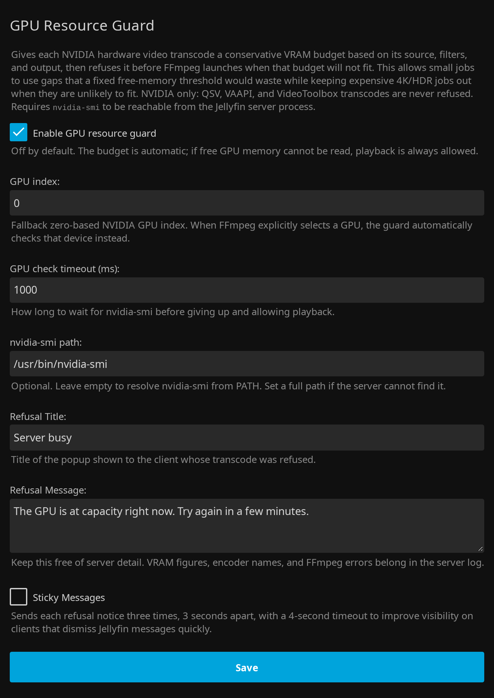

<p align="center">
  
</p>

# Jellyfin Transcode Guard Plugin

<p align="center">
  <a href="https://github.com/voc0der/jellyfin-plugin-transcode-guard/releases/latest">
    
  </a>
  <a href="https://github.com/voc0der/jellyfin-plugin-transcode-guard/tree/main/tests">
    
  </a>
  <a href="https://github.com/voc0der/jellyfin-plugin-transcode-guard/issues">
    
  </a>
  <a href="LICENSE">
    
  </a>
  <a href="https://github.com/voc0der/jellyfin-plugin-transcode-guard/blob/main/Jellyfin.Plugin.TranscodeGuard.csproj">
    
  </a>
</p>

A Jellyfin plugin that intelligently nags users when they're transcoding due to **unsupported formats or codecs**, while allowing bitrate-based transcoding to pass through without harassment.

<p align="center">
  
</p>
<p align="center">
  <em>Playback nag configuration and trigger reason selection</em>
</p>

<p align="center">
  
</p>
<p align="center">
  <em>Login nags, user exclusions, and the live session monitor</em>
</p>

<p align="center">
  
</p>
<p align="center">
  <em>GPU resource guard settings</em>
</p>

## What It Does

- Sends a playback nag when Jellyfin reports selected `TranscodeReasons`.
- Ignores bitrate-only transcodes, so users lowering quality for bandwidth do not get warned.
- Can exclude Live TV channel streams from playback nags and login nag history.
- Can send a login nag when a user keeps hitting bad transcodes over the last week or month.
- Lets you exclude users from all nags.
- Includes a live session monitor in the plugin settings page.
- Can broadcast an optional Message of the Day to users at login, with its own user exclusions and client filters.
- Can refuse an NVIDIA hardware transcode before FFmpeg starts when that job's conservative VRAM budget will not fit.
- Can stop a transcode that has been left paused past a configurable timeout, so its FFmpeg process stops holding VRAM, an encoder session, and its output files for a viewer who is not coming back.

## Installation

### Plugin Repository

1. Go to **Dashboard** → **Plugins** → **Repositories**
2. Add `https://raw.githubusercontent.com/voc0der/jellyfin-plugin-transcode-guard/main/manifest.json`
3. Install **Transcode Guard** from **Catalog**
4. Restart Jellyfin

> [!NOTE]
> Full repository of this author's plugins: [voc0der/jellyfin-plugins](https://github.com/voc0der/jellyfin-plugins).

### Manual

1. Download the latest ZIP from the [Releases page](https://github.com/voc0der/jellyfin-plugin-transcode-guard/releases/latest)
2. Extract it into your Jellyfin plugins directory:
   - Linux: `/var/lib/jellyfin/plugins/`
   - Windows: `%AppData%\Jellyfin\Server\plugins\`
   - Docker: `/config/plugins/`
3. Restart Jellyfin

#### Build from Source

```bash
dotnet build --configuration Release
```

Copy `bin/Release/net8.0/Jellyfin.Plugin.TranscodeGuard.dll` into a versioned plugin folder, then restart Jellyfin.

## Migrating from Transcode Nag

Transcode Guard is the successor to Transcode Nag, published under its own plugin identity. It is no longer listed in the plugin catalog.

- Installing Transcode Guard does not touch an existing Transcode Nag install, and does not carry its configuration over. The two run side by side until you remove the old one.
- An existing Transcode Nag install keeps working, but is finished at 1.0.1.40 and will never be offered another update.
- Install Transcode Guard, configure it, then uninstall Transcode Nag from **Dashboard** -> **Plugins** -> **My Plugins**.

## Configuration

Open **Dashboard** → **Plugins** → **Transcode Guard**.

- Choose which playback transcode reasons should trigger nags. Defaults focus on unsupported container, codec, subtitle, profile, level, resolution, bit depth, framerate, and related compatibility failures.
- Set the playback message, delay, and timeout.
- Enable **Sticky Messages** independently for playback nags, login nags, the MOTD, or GPU refusal notices when clients dismiss Jellyfin popups too quickly.
- Enable **Exclude Live TV** if Live TV channel streams should not trigger playback nags or count toward login nags.
- Optionally add client include/exclude filters using case-insensitive text matching. If the include list is empty, all clients are eligible; exclude matches always win.
- If you want login nags, enable them and set the threshold, time window, and message. The login message supports `{{transcodes}}` and `{{timewindow}}`.
- Use **Manage Excluded Users** to opt users out of both playback and login nags.
- Use the built-in live session monitor to see which active sessions currently match your rules.
- Enable the **Paused Transcode Reaper** (off by default) to stop transcodes left paused past a timeout, 25 minutes by default. The client is asked to stop first, which leaves the resume point the last progress report saved; a client that ignores that has its FFmpeg job ended server-side. Neither path signs the user out or removes their device. It applies to every paused transcode, including Live TV and CPU transcodes, and never touches direct play. Optionally warn the viewer first with a popup supporting `{{minutes}}`, and use **Manage Excluded Users (Paused Transcodes)** to leave chosen users' paused streams alone. **Also stop paused direct play** (off by default) widens it to every paused session; direct play is stop-only, since there is no FFmpeg process to end if the client ignores the stop.
- Enable **Message of the Day** (off by default) to send an announcement to everyone at login. Its options stay collapsed until the toggle is on, and it has its own message, its own **Manage Excluded Users (MOTD)** list, and its own client include/exclude filters, all independent of the nag settings.
- Enable **GPU resource guard** (off by default) to set the fallback GPU index, nvidia-smi timeout and path, and the message a refused client sees. The guard reads current free memory immediately before launch and automatically budgets each job from its source, CUDA filters, and output instead of using a fixed free-VRAM threshold. An explicit GPU selected by FFmpeg overrides the fallback index. `nvidia-smi` must be runnable by the Jellyfin server process.

## Behavior Notes

- Playback nags happen once per video, not once per session.
- Login nags are rate-limited and use stored history from the last 30 days.
- If a user returns to direct play after a bad transcode, login nags are suppressed until they regress again.
- The MOTD is sent once per session at login and is unrelated to transcode history. Sessions that were already signed in when you enabled it receive nothing until they sign in again.
- If a user qualifies for both the MOTD and a login nag, the nag waits for the MOTD to time out first, so clients that show one message at a time still display both.
- A sticky message is sent three times, 3 seconds apart, with a 4-second timeout per send. Non-sticky messages continue to use the configured message timeout.
- The GPU guard only refuses NVIDIA video transcodes. Direct Play, Direct Stream, remux, audio-only, and CPU transcodes are never refused, and playback is allowed whenever free VRAM cannot be read.
- After launch, the guard samples `nvidia-smi`'s per-process memory for the FFmpeg PID. Successful samples are logged with the job shape and budget for MiB-level calibration; if container PID namespaces prevent attribution, admission still works and the temporary reservation simply expires on its timer.
- A refused stream returns HTTP 403 and starts no FFmpeg process. Freeing GPU memory restores playback on the next attempt, with no setting change or restart.
