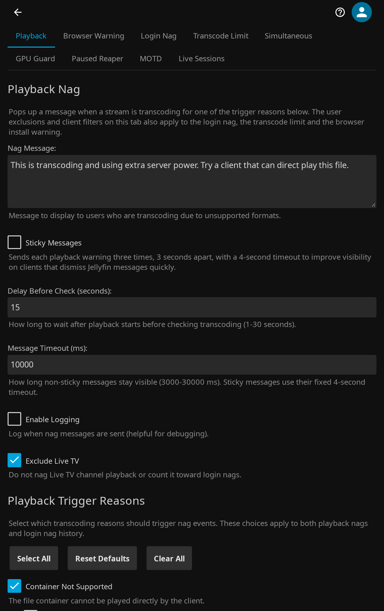
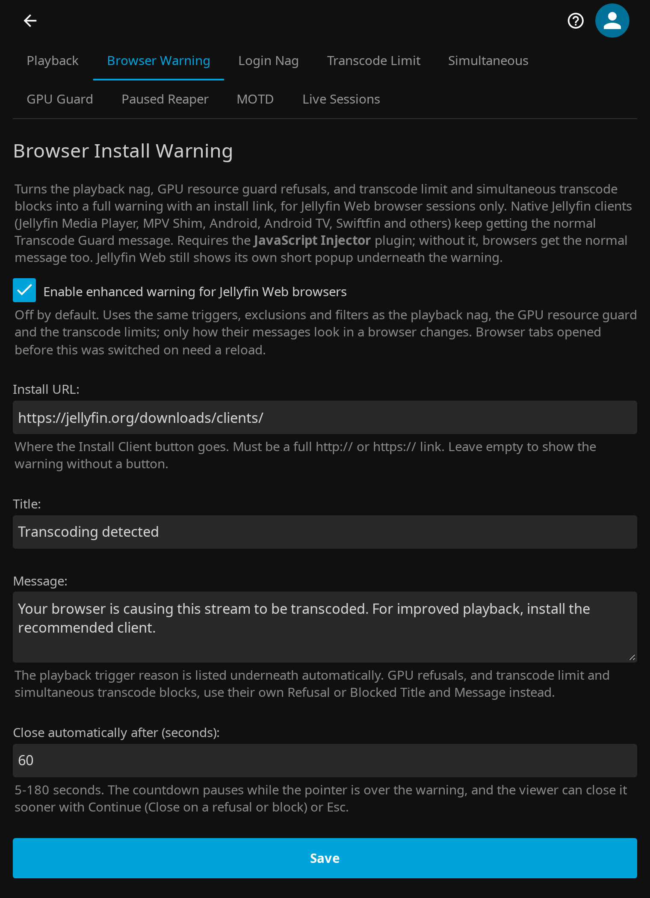
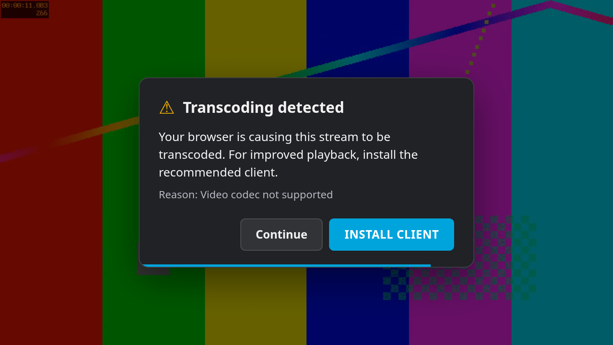
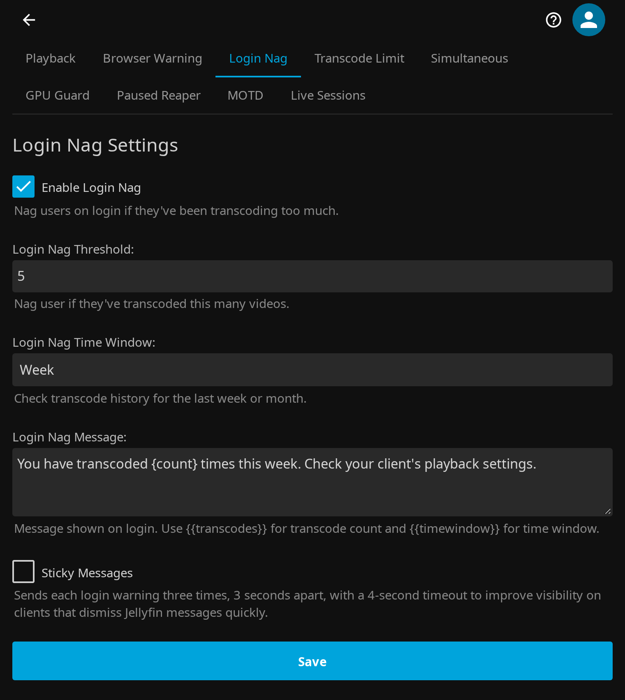
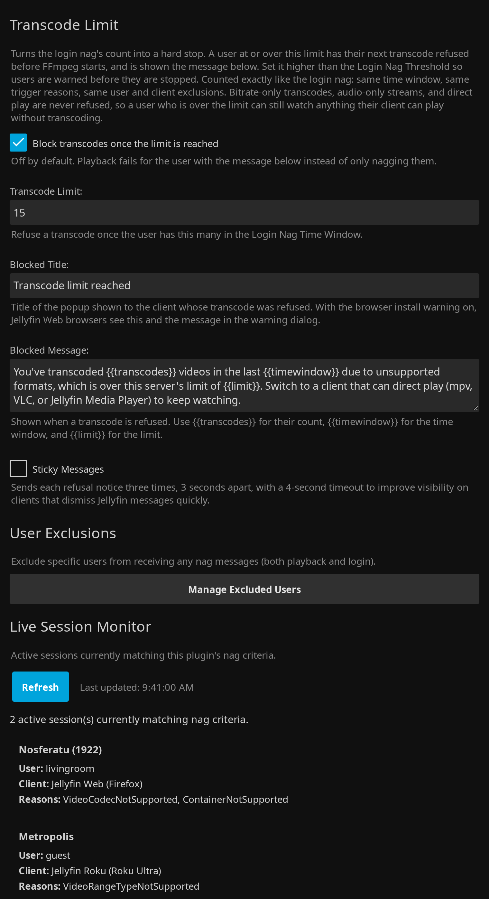
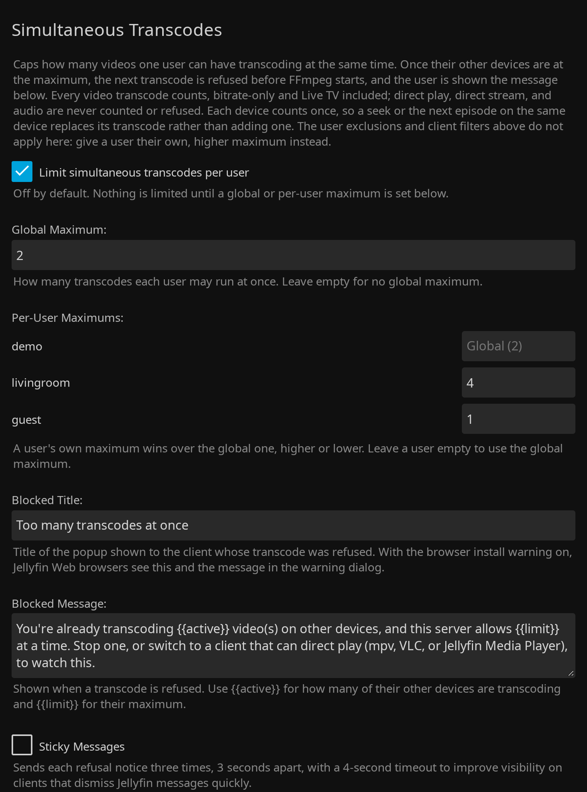
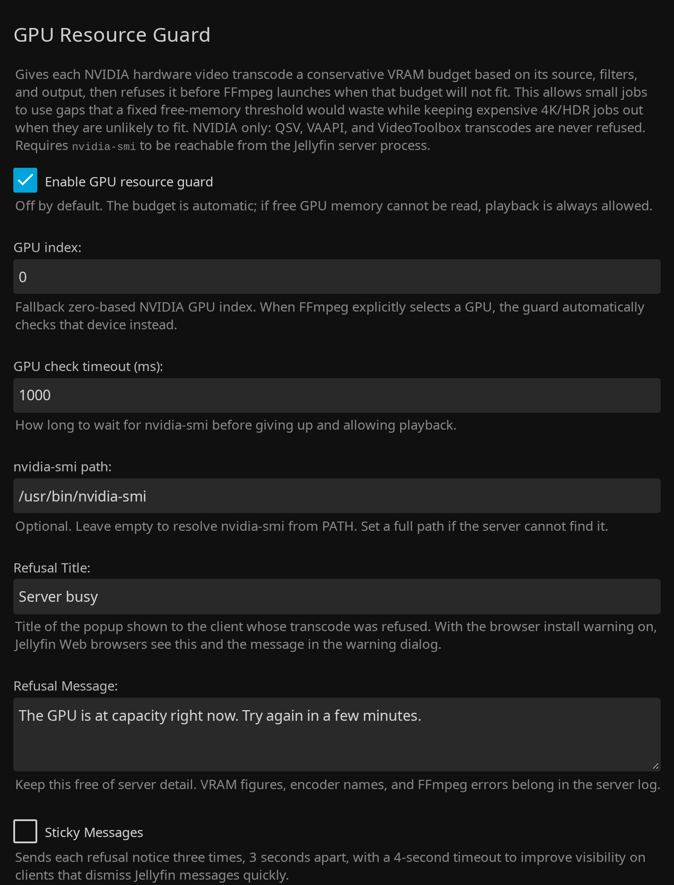
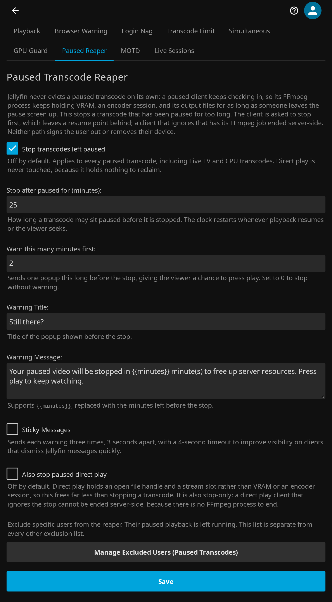
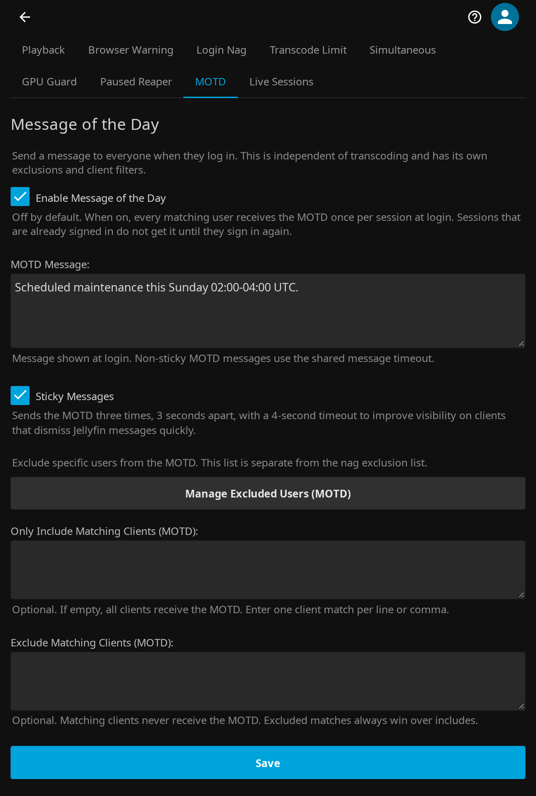
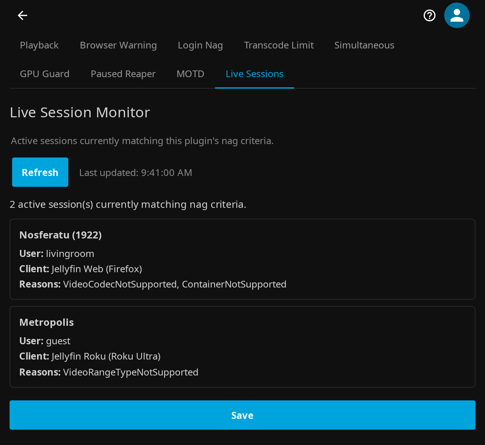

<p align="center">
  
</p>

# Jellyfin Transcode Guard Plugin

<p align="center">
  <a href="https://github.com/voc0der/jellyfin-plugin-transcode-guard/releases/latest">
    
  </a>
  <a href="https://github.com/voc0der/jellyfin-plugin-transcode-guard/blob/main/manifest.json">
    
  </a>
  <a href="https://github.com/voc0der/jellyfin-plugin-transcode-guard/tree/main/tests">
    
  </a>
  <a href="https://github.com/voc0der/jellyfin-plugin-transcode-guard/issues">
    
  </a>
  <a href="LICENSE">
    
  </a>
  <a href="https://github.com/voc0der/jellyfin-plugin-transcode-guard/blob/main/Jellyfin.Plugin.TranscodeGuard.csproj">
    
  </a>
</p>

A Jellyfin plugin that intelligently nags users when they're transcoding due to **unsupported formats or codecs**, while allowing bitrate-based transcoding to pass through without harassment.

<p align="center">
  
</p>
<p align="center">
  <em>Playback nag configuration and trigger reason selection</em>
</p>

<p align="center">
  
</p>
<p align="center">
  <em>The browser install warning, its install link, and auto-close timeout</em>
</p>

<p align="center">
  
</p>
<p align="center">
  <em>What a Jellyfin Web viewer sees when their browser forces a transcode</em>
</p>

<p align="center">
  
</p>
<p align="center">
  <em>Login nag threshold, time window, and message</em>
</p>

<p align="center">
  
</p>
<p align="center">
  <em>The transcode limit and the message a blocked user sees</em>
</p>

<p align="center">
  
</p>
<p align="center">
  <em>How many transcodes each user can run at once, with per-user overrides</em>
</p>

<p align="center">
  
</p>
<p align="center">
  <em>GPU resource guard settings</em>
</p>

<p align="center">
  
</p>
<p align="center">
  <em>The paused transcode reaper, its warning, and its own exclusion list</em>
</p>

<p align="center">
  
</p>
<p align="center">
  <em>The message of the day, with its own exclusions and client filters</em>
</p>

<p align="center">
  
</p>
<p align="center">
  <em>The live session monitor, showing who the nag would fire on right now</em>
</p>

## What It Does

- Sends a playback nag when Jellyfin reports selected `TranscodeReasons`.
- Ignores bitrate-only transcodes, so users lowering quality for bandwidth do not get warned.
- Can turn the playback nag, GPU refusals and both transcode limits' blocks into a full warning with an install link for Jellyfin Web browser sessions (needs the JavaScript Injector plugin); every other client keeps the normal message.
- Can exclude Live TV channel streams from playback nags and login nag history.
- Can send a login nag when a user keeps hitting bad transcodes over the last week or month.
- Can refuse a user's next transcode outright once that same count passes a second, higher limit, so heavy transcoders are warned before they are stopped.
- Can cap how many videos each user transcodes at the same time, with a global maximum and per-user maximums that override it.
- Lets you exclude users from all nags.
- Includes a live session monitor in the plugin settings page.
- Can broadcast an optional Message of the Day to users at login, with its own user exclusions and client filters.
- Can refuse an NVIDIA hardware transcode before FFmpeg starts when that job's conservative VRAM budget will not fit.
- Can stop a transcode that has been left paused past a configurable timeout, so its FFmpeg process stops holding VRAM, an encoder session, and its output files for a viewer who is not coming back.

See here for all [FEATURES.md](FEATURES.md).

## Installation

> [!NOTE]
> Migrating from Transcode Nag: run both until the config matches, then uninstall the old one.

### Plugin Repository

1. Go to **Dashboard** → **Plugins** → **Repositories**
2. Add `https://raw.githubusercontent.com/voc0der/jellyfin-plugin-transcode-guard/main/manifest.json`
3. Install **Transcode Guard** from **Catalog**
4. Restart Jellyfin

> [!NOTE]
> Full repository of this author's plugins: [voc0der/jellyfin-plugins](https://github.com/voc0der/jellyfin-plugins).

### Manual

1. Download the latest ZIP from the [Releases page](https://github.com/voc0der/jellyfin-plugin-transcode-guard/releases/latest)
2. Extract it into your Jellyfin plugins directory:
   - Linux: `/var/lib/jellyfin/plugins/`
   - Windows: `%AppData%\Jellyfin\Server\plugins\`
   - Docker: `/config/plugins/`
3. Restart Jellyfin

#### Build from Source

```bash
dotnet build --configuration Release
```

Copy `bin/Release/net10.0/Jellyfin.Plugin.TranscodeGuard.dll` into a versioned plugin folder, then restart Jellyfin.

## Configuration

Open **Dashboard** → **Plugins** → **Transcode Guard**. Each feature has its own tab, and Save
saves every tab at once.
